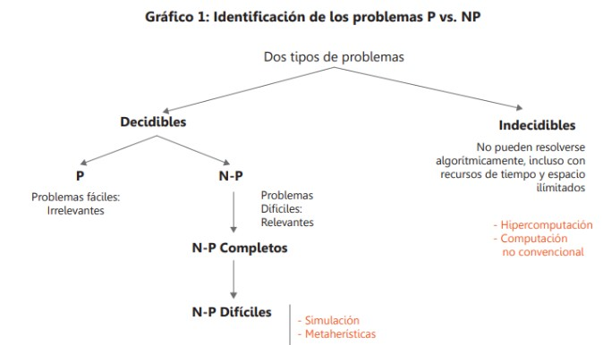

## Problema NP

### Introducción
En la teoría de la complejidad computacional, los problemas **NP** (Non-deterministic Polynomial time) son una clase de problemas de decisión que pueden ser verificados rápidamente por una máquina de Turing no determinista en tiempo polinomial. Esto significa que, dada una posible solución, es posible verificar su corrección en tiempo polinomial, aunque encontrar la solución puede ser mucho más difícil.

### Definición Formal
Un problema de decisión pertenece a la clase **NP** si:
1. Existe un algoritmo no determinista que puede resolver el problema en tiempo polinomial.
2. Dada una solución candidata, esta puede ser verificada en tiempo polinomial por una máquina de Turing determinista.

Matemáticamente, un problema está en **NP** si existe una relación binaria \( R(x, y) \) tal que:
- \( R(x, y) \) es verificable en tiempo polinomial.
- Para toda instancia \( x \) del problema, \( x \) es una instancia "sí" si y solo si existe un certificado \( y \) tal que \( R(x, y) \) es verdadero.

### Comparación con problemas P

El estudio de los procesos computacionales, conduce a una clasificación de los problemas en dos grandes clases: los problemas con solución y los problemas sin solución.

Resolver esta pregunta sería un gran avance en las ciencias de la computación y el impacto variará dependiendo de la respuesta. Un futuro donde P ≠ NP, es muy parecido al que vivimos hoy en día (es la teoría más aceptada). Pero un futuro donde P = NP abriría la puerta al desarrollo de algoritmos más eficientes en problemas que hoy en día son difíciles de resolver.

Incluso, podría significar que la criptografía actual no sería segura. El algoritmo RSA, que es el más usado en la actualidad para cifrar información, es un algoritmo que basa esa seguridad en la dificultad de resolver una operación matemática, y lo fácil que es verificar esa operación. Pero si de pronto P = NP, entonces RSA no sería seguro, y habría que migrar a una nueva forma de cifrar información.

### Ejemplo de Problema NP

- ##### El problema del viajante (TSP): 
  Dado un conjunto de ciudades y distancias entre ellas, ¿existe un recorrido que visite cada ciudad exactamente una vez y regrese al punto de partida con una distancia total menor o igual a un límite dado?
    La entrada de este problema es un grafo con pesos enteros en los arcos y un límite de peso W. Entonces podemos ver si existe un circuito Hamiltoniano de peso total como máximo igual a W en el grafo, es decir, si un conjunto de arcos que conectan los nodos en un único ciclo y éstos aparecen una sola vez. Si tenemos 10 nodos, el número de ciclos distintos se incrementa de acuerdo a O(10!). Si bien se puede mejorar la resolución del problema intercambiando nodos, la mejor solución con una máquina de Turing no determinista es de O(n4). 

    - N° de rutas con N ciudades - (n-1)!/2

    | Ciudades | Rutas |
    |----------|-------|
    | 5        | 12    |
    | 10       | 181440|
    | 20       | 121645100408832000 |

